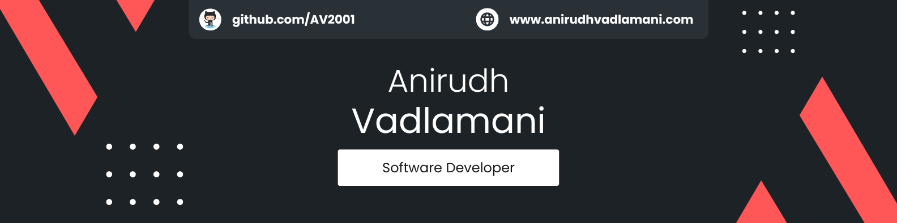

<h1 align="center">Hey, Anirudh Vadlamani here! 👋</h1>
  
  
## 👨‍💻About Me
- Pursuing BSc IT 🧑‍🎓 at Middlesex University Dubai (2 months left! 🎓).
- Currently, I'm learning about the Front-end 🎨 and the Back-end ⚙️.
- I also build some side projects if I find something exciting to build ⚒️.

## 🛠️ Programming Languages
Although I could add more logos of languages to make this section  
look appealing to you, I would be lying to myself cause I don't know them. 
  
Below are some of the languages, and libraries/frameworks that I am proficient in.

    
    
    
    

## 📊 GitHub Statistics
I'm honestly not sure if you'd be interested in knowing my GitHub stats,  
but in case if you are, here you go!   

## 📫 How To Reach Me?
Feel free to reach out to me on LinkedIn cause that's where I'm mostly active.
  

